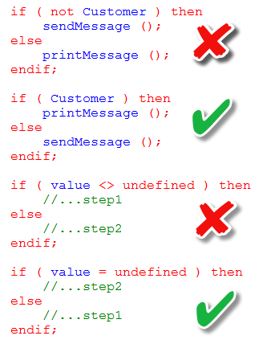
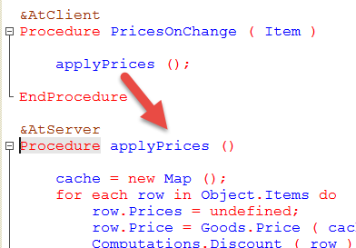
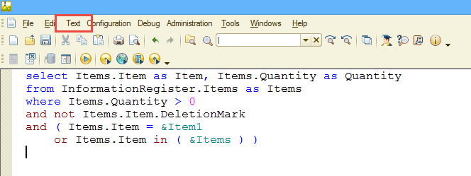
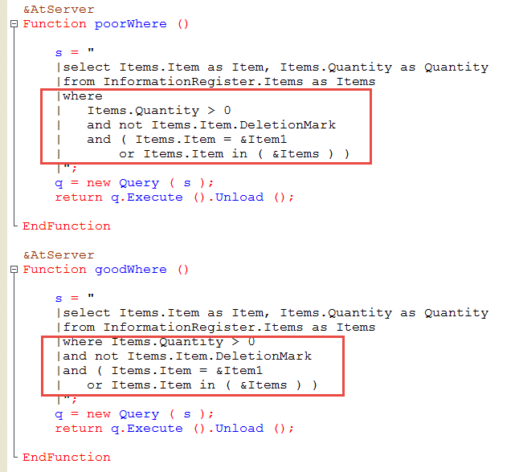

# Общие рекомендации

Главный принцип при написании программного кода – простота. Не нужно проводить преждевременную оптимизацию кода, не нужно сильно заморачиваться на оформлении кода. Старайтесь писать небольшие и предельно четкие процедуры/функции, не перегружайте смыслом переменные, не создавайте сложные имена в попытке рассказать, что делает функция, не придумывайте правила именования процедур и функций и избегайте какой-либо “наносной” формализации ради формализации. Свобода написания должна коррелировать с контекстом, четкостью выполняемых операций. Выражайте мысли кодом, а не комментариями к нему. Пишите так, чтобы вы не боялись менять потом свой код, переписывайте процедуру по несколько раз, или поменяйте логику, но делайте так, чтобы страх менять эту функцию в будущем исчез. Код должен выражать то, что вы понимаете и что требуется здесь и сейчас. Не нужно зарывать в код ситуации, которые могут когда-то теоретически произойти, не нужно проверять в коде параметры на тип или значение, только если это не совсем публичные методы, а потребители вашего кода находятся на другом уровне абстракции.

Это и некоторое другое, по пунктам:

1.  Наименования реквизитов, переменных, процедур и функций (далее функций) должны быть короткими и не должны содержать более трех слов
2.  Нотация camelcase, знаки подчеркивания использоваться не должны
3.  Экспортные функции, эспортные переменные, переменные уровня модуля (объекта или формы) должны начинаться с заглавной буквы
4.  Избегать большого кол-ва числа параметров функций. Если возникает такая необходимость, нужно рассмотреть вариант создания дополнительной функции, не пытаться сразу использовать структуру
5.  Избегать непрямых условий:  
    
6.  Избегать создание негативных реквизитов и переменных:  
    
7.  Для общих пар модулей, выполнение которых идет на сервере, для серверного модуля добавлять суффикс Srv. Пример пар модулей: Appearance, AppearanceSrv, Attachments, AttachmentsSrv и так далее.
8.  Не пытаться запихивать в общий модуль разноплановые функции, возможно, имеет смысл сделать разные общие модуля. Этот момент времени может быть хорошо распознан желанием создать в модуле многословную функцию.
9.  Не нужно думать нам группировкой кода в модуле (исключением является группировка кода для комплексных объектов, описано ниже, для формы), нужно просто располагать функции одна под другой по мере вызова:  
    
10.  Не создавать больших функций, выполняющих много разных действий. Применять принцип единой ответственности, суть которого в том, что функция должна выполнять какую-то одну логически неделимую задачу.
11.  Не бояться использовать переменные уровня модуля формы или объекта для разгрузки параметров функций.
12.  Не применять суффиксы типа “МояФункицяНаСервере” и вообще не использовать в именах какие-либо суффиксы, префиксы и любые другие соглашения для определения контекста. Все названия должны быть созданы в соответствии с тем, что функция делает, а не где она это делает.  
    Например, если нужно создать серверную функцию, которая будет вызываться из обработчика события, применять примерной такой подход:  
    
13.  Не использовать комментарии к коду, кроме оформления или действительно особых случаев, например, обход ошибки в платформе.
14.  В модулях формы использовать такое условное разбитие кода:  
      
    Условные блоки, которые остаются незадействованными, нужно удалять. Например, если у формы нет событий, то и комментарий “Form events” нужно удалить. Это же касается и других разделов, например “Variable Initialization”
15.  Не выравнивать код табуляцией или пробелами, ни по вертикали, ни по горизонтали, например:  
    
16.  Обработчики событий желательно располагать в логическом порядке их вызова (в рамках блока)
17.  Обработчики команд формы располагать выше обработчиков полей формы
18.  Не группировать все обработчики команды, просто они должны быть выше обработчиков реквизитов каждого блока. Например, команда формы (на верхней панели) должна располагаться в разделе “Group Form”, но быть выше обработчиков событий реквизитов. В свою очередь, например, команда заполнения табличной части Товары, должна находиться в группе “Table Items”, но выше обработчиков таблицы и её реквизитов.
19.  Делать отступы в одну строку между процедурными скобками
20.  Отделять пробелами скобки, знаки присваивания
21.  Стараться не использовать регионы, только если это не какие-то совсем выделенные блоки, например, реализация обработки заполнения объекта в модуле формы.
22.  Ключевые слова null, undefined – писать с маленькой буквы
23.  Оператор return должен идти без скобок: return ( 123 ) > return 123
24.  Не рекомендуется использовать сокращения кроме общепринятых в конфигурации. Все сокращения должны быть согласованы (т.е. приняты всей командой). Кроме общепринятых сокращений, допускается использовать сокращения для итераторов циклов.  
    Таблица общепринятых сокращений:

    <table border="1" cellpadding="1" cellspacing="1" style="width: 500px;">

    <tbody>

    <tr>

    <td>q</td>

    <td>объект запроса</td>

    </tr>

    <tr>

    <td>s</td>

    <td>строковая переменна</td>

    </tr>

    <tr>

    <td>p, params</td>

    <td>структура параметров</td>

    </tr>

    <tr>

    <td>i, j, k</td>

    <td>индексы</td>

    </tr>

    <tr>

    <td>obj, doc</td>

    <td>объекты</td>

    </tr>

    <tr>

    <td>r</td>

    <td>рекордсет, запись</td>

    </tr>

    <tr>

    <td>dim, dims</td>

    <td>измерения</td>

    </tr>

    <tr>

    <td>ref</td>

    <td>ссылка</td>

    </tr>

    <tr>

    <td>xxxSrv</td>

    <td>серверный общий модуль, у которого есть клиентский аналог</td>

    </tr>

    <tr>

    <td>tabDoc</td>

    <td>табличный документ</td>

    </tr>

    <tr>

    <td>t</td>

    <td>шаблон</td>

    </tr>

    </tbody>

    </table>

# Запросы

1.  Не нужно использовать мастер запросов
2.  Разработку запросов рекомендуется делать в конфигураторе, в текстовом файле с установленной расширением Query language:  
    
3.  Запуск запросов можно производить из Предприятия, используя простую обработку Query executer (находится внутри конфигурации, доступа роли AdministratorSysterm). Обработка далека от совершенства, но при определенных навыках, разработка запроса ведется даже быстрее, чем мастерами или другими умными средствами. В обработке можно настроить сохранение параметров, чтобы каждый раз не вводить путь к файлу.
4.  Нужно всегда задавать полям алиасы
5.  Всегда думать о контексте и присваивать алиасам имя с точки зрения решаемой задачи, не нужно проводить унификацию алиасов, алиас должен быть максимально приближен к задаче. Например:  
    
6.  Если перечисление полей выходит за рамки экрана, делать перенос на следующую строку, например:  
    
7.  Соединения выполняться с комментарием, например:  
    
8.  Как видно из примера выше, текст запроса должен быть максимально информативен по структуре, а не составу выбираемых полей. Не нужно зацикливаться на оформлении полей выборки, не нужно делать какую-то логическую последовательность, группировку или еще что-то в таком духе. Нужно сосредоточиться на структуре запроса.
9.  Не нужно делать лишних отступов, например:  
      
    На первый взгляд первый запрос выглядит красивее, но при разработке сложных запросов, такая “красота” начинает рябить, и на первый план выходит ровность структуры.

# Реквизиты

1.  Внимательно анализировать контекст и не повторять его в названии реквизитов. Например, если в документе есть валюта документа, то реквизит должен называться Currency, а не DocumentCurrency
2.  Для реквизитов объектов всегда задавать подсказку (за некоторыми исключениями). Если нет уверенности в инглише – начинать подсказку с префикса “!!!”. Всегда проверять синтаксис в ворде (хорошая привычка держать ворд всегда открытым для этого)
3.  Если форма объекта принимает параметры, задавать такие параметры на вкладке Параметры самой формы

# Метаданные

1.  Для вложенных (подчиненным) подсистем не задавать подсказку

---

См. также:

- [Шаблон для конфигуратора](/download/template.st)
- [Пример обработки](/download/example.epf)