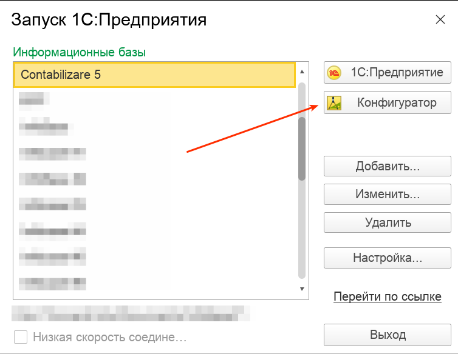
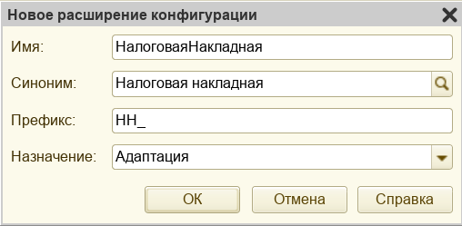
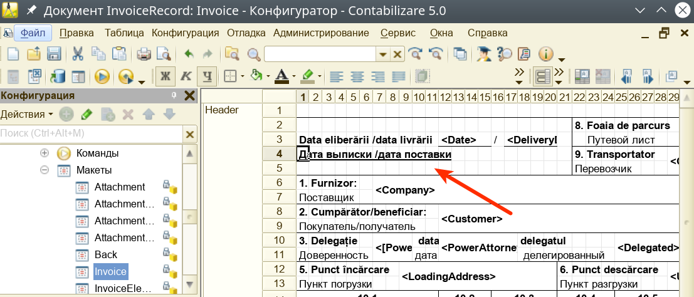
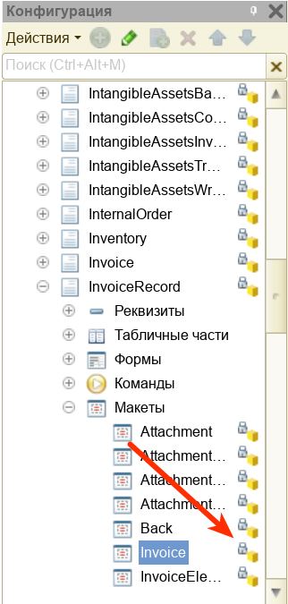

Кастомизация - это процесс, направленный на изменение работы программы под требования предприятия. Необходимость в кастомизации возникает в случах, когда заложенной в программу функциональности не хватает, либо вам требует внести в систему специфичные изменения. Хорошим примером кастомизации, может служить необходимость изменения печатной формы документа, например - Налоговой накладной.

Существует два способа кастомизации:

1. Использование механизма расширений (рекомендуемый). Использование расширений предпочтительно тем, что все изменения в программе будут являться внешними по отношению к исходной конфигурации, что в свою очередь, позволяет безболезненно проводить обновление программы официальными версиями Contabilizare, без потери ваших собственных изменений. Расширения, можно воспринимать как плагины или addon-ы, которые вы часто можете встречать в других программных решениях, таких как почтовые клиенты или интернет-обозреватели (Chrome, Mozilla FireFox и другие).
2. Непосредственное изменение исходной конфигурации (не рекомендуемый). Этот вариант требует глубоких знаний в области конфигурирования системы 1С:Предприятие 8, предпочтителен в случае значительных программных изменений и требует ручного управления загрузкой официальных обновлений Contabilizare.

Рассмотрим оба варианта модификации программы на примере изменения печатной формы документа Налоговая накладная.

# Запуск конфигуратора

В обоих случаях, адаптация программы осуществляется при помощи программы Конфигуратор, входящей в состав установочного дистрибутива 1С:Предприятие 8. Для запуска конфигуратора, необходимо в стартовом окне программы, выбрать режим запуска Конфигуратор:

Затем, нужно открыть конфигурацию:

# Использование расширения

После того, как конфигурация была открыта, добавим расширение:

<video controls><source src="img/Peek 2021-03-31 11-12.mp4" type="video/mp4"></video>

И установим следующие параметры:

После этого, по правому клику на строке с расширением, сменим область его действия:

<video controls><source src="img/Peek 2021-03-31 13-08.mp4" type="video/mp4"></video>

Это сделает наше расширение доступным для всех [организаций](/users#organizations) (не путать с контрагентами).

Следующий шаг - добавление в наше расширение объектов, которые мы хотим доработать (расширить их функциональность). Для этого, в дереве объектов найдем нужную нам печатную форму и добавим ее в расширение:

<video width="800" controls><source src="img/Peek 2021-03-31 13-25.mp4" type="video/mp4"></video>

Теперь, мы можем менять добавленную в расширение печатную форму. Например, выделим надпись **Дата выписки** жирным шрифтом с подчеркиванием:

После модификации, сохраним внесенные изменения:

<video controls><source src="img/Peek 2021-03-31 13-43.mp4" type="video/mp4"></video>

И запустим программу в режиме 1С:Предприятие, убедимся, что наше расширение успешно применилось:

<video width="800" controls><source src="img/Peek 2021-03-31 13-48.mp4" type="video/mp4"></video>

Таким образом, мы расширили функциональность печатной формы, добавив туда собственный стиль оформления надписи. При этом, мы не производили изменений в основной конфигурации, она осталась неизменной. Наше расширение как бы "наложилось сверху" и заменило собой оригинальную печатную форму.

# Управление расширениями

Вы можете создавать сколь угодно много расширений, и включать в них самые разнообразные объекты. Технически, расширения представляют из себя файлы с расширением `cfe`. Расширение можно сохранить в файл, передать по электронной почте и загрузить в другой информационной базе. При необходимости, расширение можно отключить или удалить (например, специфичная функциональность вам больше не требуется, или она была включена в официальное обновление Contabilizare).

Выше, мы использовали Конфигуратор для создания и подключения расширения. В дополнении к этому, управление расширениями доступно и на пользовательском уровне, в основном режиме работы программы 1С:Предприятие. Управление осуществляется в режиме включенной [функции технического специалиста](/faq#allfunctions), при помощи встроенной обработки `Управление расширениями`:

<video width="800" controls><source src="img/Peek 2021-03-31 14-24.mp4" type="video/mp4"></video>

# Непосредственное изменение исходной конфигурации

Это второй способ кастомизации, который требует от пользователя значительно более серьезных навыков работы в режиме конфигурирования системы, и рекомендуется только для выполнения существенных доработок.

Конфигурация Contabilizare 5 поставляется в режиме включенной поддержки пользователей, что по умолчанию, отключает возможность модификации решения, визуально, все объекты в дереве метаданных "на замочке":

Для включения возможности изменения конфигурации, необходимо произвести следующие действия:

<video width="800" controls><source src="img/Peek 2021-03-31 14-39.mp4" type="video/mp4"></video>

При этом конфигурация становится доступной для модификаций.

!!!warning "Внимание!"
    Подробное описание процессов конфигурирования системы 1С:Предприятие 8 выходит за рамки справочного портала Contabilizare 5, и доступно на [сайте информационно-технологической поддержки компании 1С](https://its.1c.ru/#dev/doc_dev)

# Приложение: Идентификаторы и имена объектов

Для того, что бы вам было проще находить объекты конфигурации в структуре метаданных Contabilizare 5, мы подготовили список соответствия идентификаторов и имен объектов:
{!id/objects.md!}