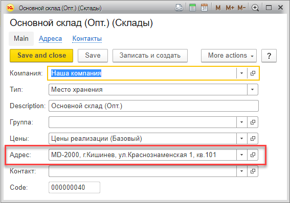

Документ вводится для подготовки формы налоговой накладной. Документ может быть введен непосредственно через журнал учета налоговых накладных (меню `Учет / ТТН, НН`), или на основании документов: Реализация, Перемещение, Возврат поставщику и ряда других.

Налоговая накладная содержит в себе большой набор полей для заполнения, поэтому при вводе нового документа, система предоставляет сервис автоматической инициализации условно-постоянных значений реквизитов формы. В частности, выполняются такие вычисления:

1. Если НН вводится на основании, большая часть реквизитов будет получена из документа основания (Склад, Компания, номенклатурный состав и другие).
2. Если используются диапазоны номеров накладных, программа автоматически будет пытаться определить использованный в последний раз, данным пользователем, диапазон.
3. Такие поля как `Перевозчик`, `Диспетчер`, `Кладовщик`, копируются из последней налоговой накладной, введенной по данному складу. Таким образом, чтобы они заполнялись автоматически, необходимо наличие в базе как минимум одной введенной накладной по каждому используемому складу.
4. Поле `Банковский счет` устанавливается в значение `Банковский счет`, заданное в договоре с покупателем. При вводе на основании, в качестве договора используется договор из документа-основания. При непосредственном вводе, используется банковский счет, установленный для основного договора. В случе внутренних перемещений, используется банковский счет нашей компании, заданный по умолчанию, в справочнике [Компании](/c/Companies).
5. Поле `Пункт погрузки` содержит адрес склада, с которого осуществляется отгрузка товаров. Для автоматического заполнения этого поля, в карточке склада должен быть задан адрес:

# Формирование номера

Для автоматического формирования номера накладной, в документе должно быть задано значение поля `Диапазон`. По умолчанию, при вводе нового документа, данное поле заполняется значением диапазона из предыдущего документа, поэтому если значение не задано, достаточно будет его указать один раз на диапазон.

Если поле `Диапазон` заполнено, поля `Серия` и `Номер` можно оставить пустыми. В этом случае, система автоматически проинициализирует данные поля при записи документа. При этом будет соблюдена последовательная нумерация и контроль дубликатов. В некоторых случаях, например при вводе документа задним числом, вы можете указать серию и номер самостоятельно, система в любом случае проведет контроль дубликата и не позволит внести в систему два документа с одним номером.

Стоит обратить внимание, что поле `Диапазон` рекомендуемо, но не является обязательным к заполнению. Если диапазон не указан, программой будет предпринята попытка установить серию и номер документа, автоматически. В этом случае применяется следующий алгоритм: программа находит последний введенный в систему документ по складу, указанному в документе, и увеличивает номер на единицу. Полученный результат устанавливается в качестве нового номера документа. При необходимости, номер можно ввести вручную.

!!!warning "Внимание!"
    При интенсивной отгрузке и формировании большого числа налоговых накладных, рекомендуется использовать диапазоны, во-избежании проблемы дублирования номеров фактур.

При использовании e-Factura, данные по номерам документов могут быть загружены обработкой [Загрузка накладных](/r/LoadInvoices). Если этот сервис по каким-либо причинам не может быть использован, вы можете ввести данные о номере вручную, непосредственно в сам документ. Однако, следует учитывать, что для правильного формирования полного номера фактуры, должна быть корректно заполнена длина номера (без учета серии) в поле `Длина номера` справочника [Диапазоны](/c/Ranges).

Информация о документах без диапазона и/или пропусках в нумерации, может быть получена при помощи отчета `Проблемные БСО` (см. меню `Бухгалтерия / Отчеты / Проблемные БСО`).

# Статус документа

Каждая налоговая накладная в системе имеет статус, по которому пользователь может ориентироваться и при необходимости, устанавливать его вручную.

В таблице ниже определены статусы и их значение:

| Статус                | Значение                                                                                                                                                                                                                                                                                                                                                                                                                                    |
| --------------------- | ------------------------------------------------------------------------------------------------------------------------------------------------------------------------------------------------------------------------------------------------------------------------------------------------------------------------------------------------------------------------------------------------------------------------------------------- |
| Записано              | Значение устанавливается автоматически, при записи документа                                                                                                                                                                                                                                                                                                                                                                                |
| Напечатано            | Значение устанавливается автоматически, при печати документа. В этом (и ниже) статусах, становится недоступным для редактирования документ-основание. Для физических бланков, начиная со статуса `Напечатано`, в системе автоматически формируется бухгалтерская запись по списанию бланка (см. меню `Бухгалтерия / БСО / Автосписание бланков`). Если статус вернуть обратно в состояние `Записано`, бухгалтерская запись будет удалена. |
| Отправлено            | Значение устанавливается вручную.                                                                                                                                                                                                                                                                                                                                                                                                           |
| Возвращено            | Значение устанавливается вручную и отражает операцию получения от покупателя подписанной налоговой накладной. |
| Ожидание номера       | Значение устанавливается автоматически после выгрузки накладных в систему [eFactura](/p/UnloadInvoices)                                                                                                                                                                                                                                                                                                                                     |
| Выгружено в e-Factura | Значение устанавливается после загрузки номеров из [eFactura](/p/LoadInvoices).                                                                                                                                                                                                                                                                                                                                                             |
| Аннулировано          | Значение устанавливается вручную. Имеет смысл задавать только для физических бланков (электронный бланк может быть распечатан повторно).                                                                                                                                                                                                                                                                                                    |

При печати накладной, ее статус устанавливается в значение `Напечатано` и редактирование документа блокируется. В том случае, если по каким-то причинам необходимо изменить уже распечатанный документ, необходимо выполнить следующие действия:

1. Изменить статус налоговой накладной с `Напечатано` на `Записано`.
2. Записать и закрыть налоговую накладную.
3. Открыть требуемый документ Реализация, при этом он уже должен открыться с возможностью редактирования.
4. Внести изменения в реализацию, и провести ее. При проведении, программа автоматически обновит введенную на основании налоговую накладную.
5. Открыть и повторно распечатать налоговую накладную.

---

{!id/ranges.md!}