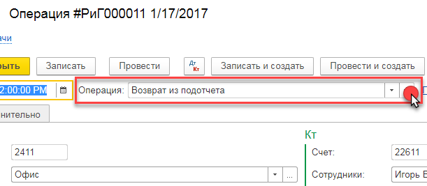
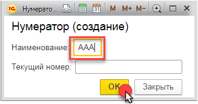
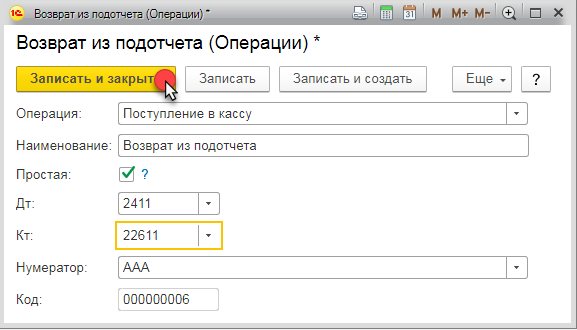
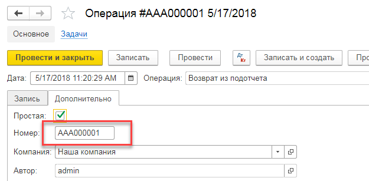
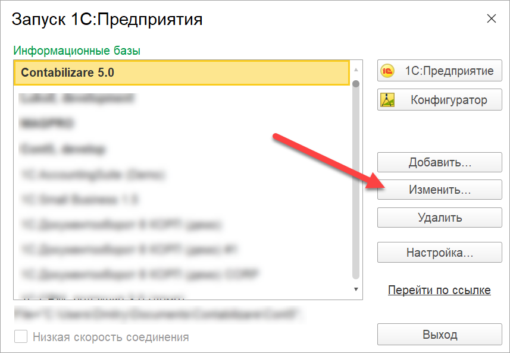
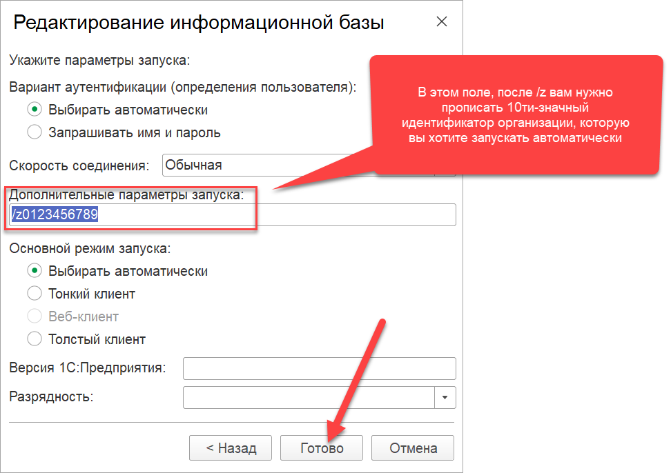

# Как реализовать раздельную нумерацию в документе Операция?

Для реализации раздельной нумерацию в документе Операция необходимо выполнить следующие шаги:

1.  В документе откройте поле “Операция”

1.  В открывшемся окне, кликните на поле “Нумератор” и нажмите “создать”:

1.  В открывшемся окне укажите наименование нумератора (например “ААА”) и нажмите кнопку “ОК”:

1.  Нажмите кнопку “Записать и закрыть” в открытом окне:

1.  При записи или проведении документа с указанной “Операцией” в которой заполнен нумератор (в нашем примере в “Операции” “Возврат из подотчета” мы указали нумератор “ААА”), номер документа должен быть сформирован с учетом указанного нумератора (ААА000001):

# Как вводить документы на определенную дату?

При вводе документов в систему, дата документа устанавливается в текущую дату сеанса пользователя.

Однако, при вводе документов задним числом, может потребоваться, чтобы дата документа автоматически устанавливалась в определенную дату, без необходимости её изменения каждый раз при вводе нового документа.

Для этой задачи, при вводе документа, в его форме, нажмите правым кликом в поле `Дата. В появившемся контекстном меню, выберите Закрепить дату`. В результате этого действия, появится диалоговое окно с возможностью выбора нужной даты для новых документов данного типа. Данная настройка работает для каждого типа документа отдельно.

{!id/note.md!}
	Если в контекстном меню отсутствует данная функция, возможно у пользователя нет прав на сохранение настроек, либо тип документа не предусматривает такую возможность (например, документы по вводу остатков).

# Почему я не вижу проводки по авансам контрагентов?

В документах [Расходная накладная](/d/Invoice) / [Поступление товаров](/d/VendorInvoice) присутствует флаг `Закрывать предоплату`.

Если флаг в документе выключен, проводок и движений по регистрам задолженности, по зачету аванса, не будет. Закрытие авансов в таких случаях, необходимо будет производить вручную, при помощи документа [Корректировка долга покупателя](/d/AdjustDebts).

Если флаг включен, алгоритм проведения будет производить анализ и закрытие предоплаты по договору, заказу и расчетному документу. Оставшуюся после закрытия аванса сумму, система будет проводить как задолженность покупателя / поставщику. Счет учета аванса для бухгалтерской проводки, будет получен из исходного документа оплаты, ранее образовавшего аванс. При закрытии полученных авансов от покупателей, системой будет автоматически отсторнирован НДС, по ставке, указанной в документе оплаты.

> Примечание: значение флага `Закрывать предоплату` заполняется автоматически из договора с контрагентом при вводе нового документа, см. справочник [Договоры](/c/Contracts)

См. также:

*   [Варианты оплаты](/c/PaymentOptions)
*   [Почему в проводках я не вижу заказ покупателя или документ задолженности?](/faq#WhereAreDetails)
*   [Почему при выборе счетов для авансов полученных/выданных доступны кредиторские и дебиторские счета?](/faq#AdvanceAccounts)

# Как настроить помесячный учет авансов контрагентов?

Для того, чтобы при вводе первичных документов, программа не формировала проводки по авансам выданным/полученным, необходимо в настройках программы включить флаг `Закрывать авансы в конце месяца`. Настройка расположена в `Меню / Настройки / Бухгалтерия`.

В этом случае, формирование проводок по авансам (включая НДС с авансов) необходимо будет формировать вручную, используя регламентные документы [Закрытие полученных авансов](/d/ClosingAdvances) и [Закрытие выданных авансов](/d/ClosingAdvancesGiven)

# Почему в проводках я не вижу заказ покупателя или документ задолженности?

В системе ведется учет взаиморасчетов с контрагентами по двум направлениям: оперативно-детальный учет, и бухгалтерский учет. Основное отличие заключается в структуре регистрируемой информации, и ролях её потребителей.

В оперативном учете заложена следующая детализация:

*   Контрагент
*   Договор
*   Счет учета задолженности (221/521/224/523)
*   Первичный документ
*   Заказ, Счет на оплату
*   Вариант оплаты
*   Дата предстоящей оплаты

Механизм учета такой глубокой аналитики реализован прозрачно для пользователя, не обязывает его использовать все перечисленные признаки, и позволяет ответить на такие вопросы:

*   Какова просрочка долга?
*   Можно ли предоставить скидку за срочность платежа?
*   Какие предстоят поступления в ближайшую неделю/месяц и т.д.?
*   По заказу была сделана предоплата? А отгрузка?
*   Как заказчик будет производить оплату? По банку или кассе?

Потребителем данной информации может быть любой авторизованный пользователь системы, с соответствующими правами.

Одновременно с этим, в бухгалтерском учете, система отражает взаиморасчеты по аналитике:

*   Счет учета (221/521/224/523)
*   Контрагент
*   Договор
*   Документ

Для анализа данных, как правило, используются карточки счета/субконто, в основании которых лежат проводки, сформированные первичными для принятия к учету документами (банковская выписка, накладная и т.д.), а основными пользователями информации, являются бухгалтера. Очевидно, что на основании только этих данных, получить аналитику для принятия решений – затруднительно.

Таким образом, рекомендуется всем пользователям системы, для анализа взаиморасчетов, использовать отчеты [Дебиторы](/r/Debts) / [Кредиторы](/r/VendorDebts), а для специфичных бухгалтерских задач, карточки и оборотно-сальдовые ведомости.

Организация двойного учета (оперативно-детального и бухгалтерского) имеет особенность - в бухгалтерском учете, проводки по выделению/закрытию авансов, автоматически формируются только с детализацией до договора. При этом, в оперативно-детальном учете, система контролирует авансы на уровне каждого документа. Этот нюанс может выражаться в отсутствии проводок по закрытию авансов в бухгалтерском учете, в случае, когда по одному договору ведется позаказная работа с разными способами расчетов.

Например, если в рамках одного договора, по заказу №1 осуществляется предоплата, а по заказу №2 – оплата после реализации, тогда в бухгалтерском учете, реализация по заказу №2 не сделает проводки на закрытие аванса, потому что аванс предназначался для заказа №1\. Тем не менее, в конце отчетного месяца, документ [Закрытие авансов полученных](/d/ClosingAdvances) (или [Закрытие авансов выданных](/d/ClosingAdvancesGiven)) проведет закрытие авансов по бухгалтерии с выделением НДС. Такие случаи считаются очень редкими, потому что как правило, договора предусматривают какую-то одну методику расчетов. Во избежание трудно-анализируемых учетных ситуаций, не рекомендуется использовать один договор для разных методов расчетов.

См. также:

*   [Варианты оплаты](/c/PaymentOptions)
*   [Почему при выборе счетов для авансов полученных/выданных доступны кредиторские и дебиторские счета?](/faq#AdvanceAccounts)
*   [Почему я не вижу проводки по авансам контрагентов?](/faq#WhereIsAdvance)

# Почему не могу найти покупателя в списке выбора?

Убедитесь, что в справочнике [Контрагенты](/c/Organizations), для покупателя установлен флаг Покупатель:

# Почему при выборе счетов для авансов полученных/выданных доступны кредиторские и дебиторские счета?

Это сделано для пользователей, которые не хотят выделять в течение периода авансы на отдельные счета, а предпочитают анализировать задолженность используя только дебетовый (для покупателей) или кредитовый (для поставщиков) счет. В этом случае, для счета авансов они установят тот же счет, что и для учета задолженности (221 или 521).

См. также:

*   [Варианты оплаты](/c/PaymentOptions)
*   [Почему в проводках я не вижу заказ покупателя или документ задолженности?](/faq#WhereAreDetails)
*   [Почему я не вижу проводки по авансам контрагентов?](/faq#WhereIsAdvance)

# Почему я должен каждый раз указывать в документе бухгалтерские счета?

Практически для любого документа в системе, программой предусмотрено начальное его заполнение бухгалтерскими счетами учета. Если при вводе документов, вам постоянно приходится указывать счет учета покупателя, поставщика, товара т.д., проверьте следующие настройки счетов в `Меню / Учет / Счета в документах`, а также в `Меню / Настройки / Бухгалтерия`.

# А где скидки?

Скидки являются опциональными в системе, и для их включения необходимо в справочнике [Организации](/c/Companies) для требуемой компании, включить флаг `Скидки`, если требуются скидки для покупателей, и флаг `Скидки в поступлениях`, при вводе документов где указаны скидки поставщиков.

# Как выслать отчет по почте или расписанию?

**Отчёт можно отправить по электронной почте** сразу же после его сформирования в системе, нажав на  кнопку **Выслать (Ещё - > Выслать) **либо есть возможность сделать автоматическую рассылку **нажав на кнопку   **, то есть отчёты будет формироваться  и отправляться автоматически, после указания даты начала рассылки, периодичности рассылки и электронного адреса отправителя и получателя:

# Каким образом отразить в учете приобретенное оборудование к установке, как незавершенный долгосрочный актив?

Следует воспользоваться документом #VendorInvoice#. Данный актив нужно оприходовать как товар на счет 1212, а затем ввести его в эксплуатацию документом [Ввод в эксплуатацию ОС](/d/Commissioning).

# Где устанавливаются счета учета и износа для ОС или НМА?

Счета задаются непосредственно в карточках [основных средств](/c/Assets), [нематериальных активов](/c/IntangibleAssets)

# Каким образом ввести сотруднику оклад и премиальные, рассчитываемые от суммы оклада?

При [приеме на работу](/d/Hiring) следует воспользоваться таблицей `Дополнительные начисления` (таблица доступна при начале редактирования строки требуемого сотрудника), где указать начисление `Процент от оклада` и заполнить значение процента.

# Для чего нужно отклонение с типом «Резерв +/-»?

Это нужно в случаях, когда предприятие вместо сверхурочных, накапливает часы переработки, с последующей возможностью их зачета в случае отсутствия сотрудника на работе. Эта информация регистрируется при вводе документа {!id/timesheet.md!}.

Например, если сотруднику нужно уйти в среду с работы на два часа раньше, он может в понедельник, отработать больше положенного по графику, на эти два часа. В табеле он укажет 8 часов + 2 часа «Резерв +», а в среду 6 часов и 2 часа «Резерв –». Позже эти сведения попадают в начисление зарплаты, а затем это отражается в расчетном листке и других отчетах.

# Чем отличаются Сотрудники от Физических лиц?

Физические лица в программе ассоциированы с физическим субъектами, или проще говоря - с конкретными людьми. Сотрудники - это профиль физического лица, в котором определяется табельный номер, должность и другие характеристики.

Таким образом, в системе может быть создано несколько сотрудников со ссылкой на одно и тоже физическое лицо. Примерами таких случаев могут быть:

- Работа сотрудника по совместительству. В этом случае, нам нужно будет создать в справочнике [Сотрудники](/c/Employees) двух сотрудников и принять их на работу.
- Сотрудник работал и уволился, и через время снова устроился к нам на работу. В этом случае, нужно будет создать два сотрудника, с разными табельными номерами и другими атрибутами.

# Каждый раз при запуске программы мне приходится дважды авторизовываться

Для того, чтобы вам не приходилось каждый раз указывать с какой организацией вы хотите работать, нужную организацию можно прописать в параметрах запуска, в стартовом диалоговом окне 1С.

Ниже на картинках пошаговая инструкция:

Для того, чтобы узнать 10ти значный код базы организации, нужно открыть в программе:

# Как в налоговой накладной исправить количество или ставку НДС, ведь она недоступна для редактирования?

Большая часть полей налоговой накладной, введенной на основании, недоступна для непосредственного редактирования. Это связано с тем, что данные документа основания автоматически обновляют связанную с ним налоговую накладную. Таким образом, вам необходимо просто открыть документ основание и произвести в нем необходимые изменения. При этом, налоговая накладная, будет обновлена автоматически (возможно, потребуется повторное открытие формы)

# Если я провела реализацию и не ввела налоговую накладную, попадет ли данная продажа в декларацию по НДС?

Нет, не попадет, ровно как и не попадет в регистр продаж. Декларация по НДС строится на базе оформленных налоговых накладных, в статусе `Напечатано`, `Отправлено` или `Выгружено в e-Factura`.

См. также [Налоговая накладная](/d/InvoiceRecord)

# Каким образом отразить в учете приобретённое оборудование к установке, как незавершенный долгосрочный актив?

Следует воспользоваться документом [Поступление товаров](/d/VendorInvoice). Данный актив нужно оприходовать как товар на счет `1212`, а затем ввести его в эксплуатацию документом [Ввод в эксплуатацию ОС](/d/Commissioning).

# Почему не могу найти поставщика в списке выбора?

Убедитесь, что в справочнике [Контрагенты](/c/Organizations), для требуемого элемента, установлен флаг `Поставщик`.

# Где можно настроить счета по умолчанию при вводе документов?

При создании документов, система помогает пользователю проводить предварительное начальное заполнение бухгалтерских счетов, используемых в документе. В случае, когда вам требуется изменить или дополнить поведение системы нужными вам счетами, вы можете воспользоваться специальными настройками из раздела `Меню / Бухгалтерия / Счета в документах`. Эти же настройки, доступны через формы справочников [Номенклатура](/c/Items) и [Контрагенты](/c/Organizations) (см. навигационную ссылку `Счета`, в выбранном элементе).

# Где настраиваются счета учета основных средств и нематериальных активов?

Если в документе поступления приходуются долгосрочные активы с использованием соответствующих вкладок, счета учета активов задаются непосредственно в их карточках:

# Как заполняется колонка Описание в отчетах Книга покупок и Книга продаж?

Содержимое этой колонки формируется следующим образом:

1. Если в исходном документе (например [Поступление товаров](/d/VendorInvoice), [Налоговая накладная](/d/InvoiceRecord) и т.д. ), пользователем задано описание операции, тогда в качестве содержимого колонки будет выведено это описание. Описание задается в поле `Описание` соответствующих исходных документов. Данное поле не обязательно для заполнения.
2. Если описание не задано, тогда значение колонки будет содержать типы приходуемой/реализуемой номенклатуры. Тип номенклатуры задается в соответствующих справочниках: [Номенклатура](/c/Items), [ОС](/c/FixedAssets) и [НМА](/c/IntangibleAssets).
3. Если и типы номенклатуры не заданы, в колонку будет выведено только название документа.

# Куда делось меню Все функции?

Начиная с версии платформы 1С:Предприятие 8.3.17, в программе был реализован механизм под названием **Режим технического специалиста**. Только в этом режиме, пользователю (при наличии соответствующих прав доступа) доступна возможность просмотра всех объектов конфигурации. По умолчанию, эта настройка выключена, и для ее включения, необходимо выполнить следующие действия:

<video width="800" controls><source src="/img/Peek 2021-03-31 15-01.mp4" type="video/mp4"></video>

# Как менять печатные формы?

Если вас не устраивает сформированная программой печатная форма документа, вы можете изменить ее по месту, включив режим редактирования, как показано в этом ролике:

<video width="800" controls><source src="/img/Peek 2021-04-01 16-02.mp4" type="video/mp4"></video>

Если вам нужно на постоянной основе внести изменение в печатную форму программы, мы рекомендуем использовать для этой задачи механизм расширений. Подробнее о том, как это делать см. раздел [Кастомизация](/customization). Там же, смотрите [соответствие идентификаторов и имен документов](/customization#objectNames).

# Как оформить заказ на услуги когда известна сумма услуг, но нет количества?

Бывают ситуации, когда мы оказываем заказчику услуги по заранее обговоренной сумме, при этом мы не знаем, сколько часов (или визитов) клиенту нам нужно будет осуществить. В этом случае, при вводе таких заказов услуг, можно не указывать количество (для услуг это поле не обязательно), а ввести только сумму. При такой схеме, документ реализации, не будет контролировать количество услуг, но будет контролировать их сумму, чтобы совокупностью расходных накладных, введенных ранее на основании этого заказа, она (сумма) не была превышена.

# Как изменить уже утвержденный заказ покупателя или внутренний заказ?

Для этой возможности у пользователя должно быть установлено соответствующее право, см. `Настройки / Пользователи / Дополнительно / Имеет право изменять утвержденные заказы покупателей`:

