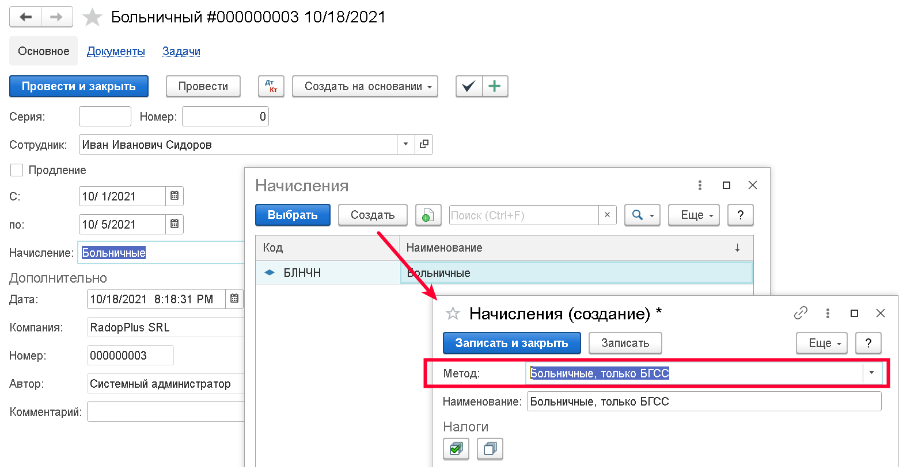
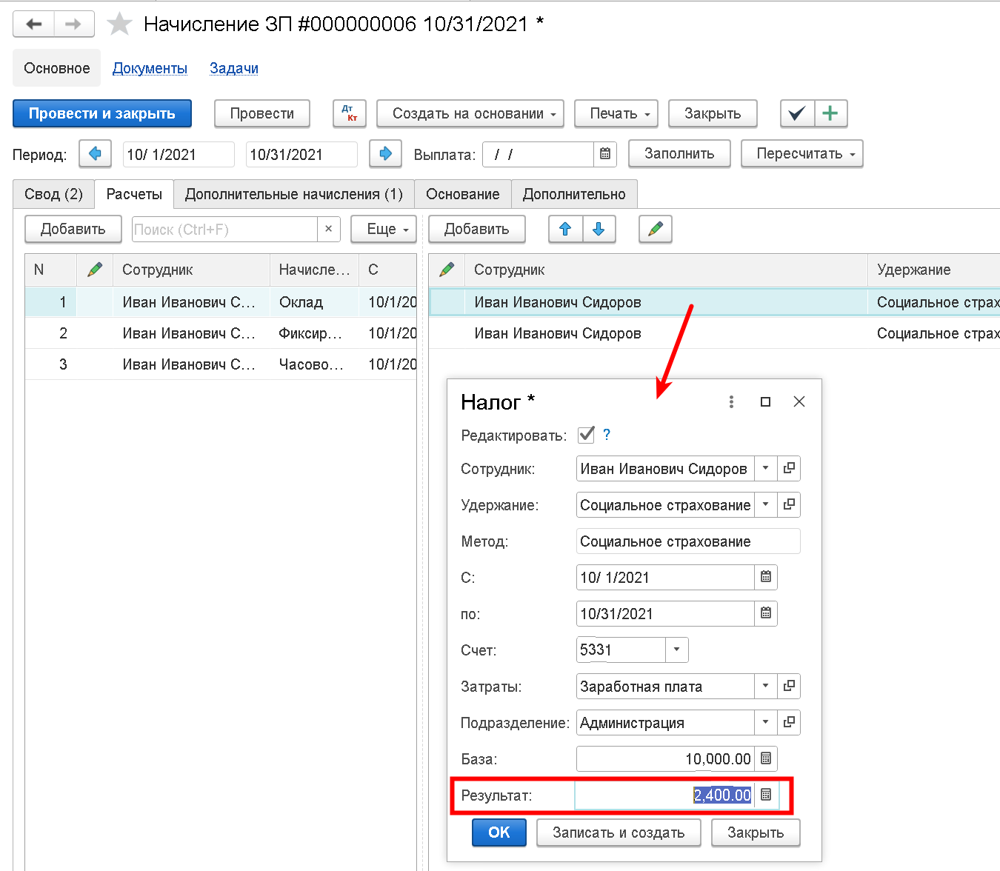
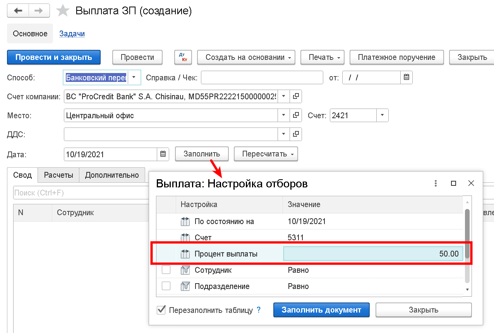
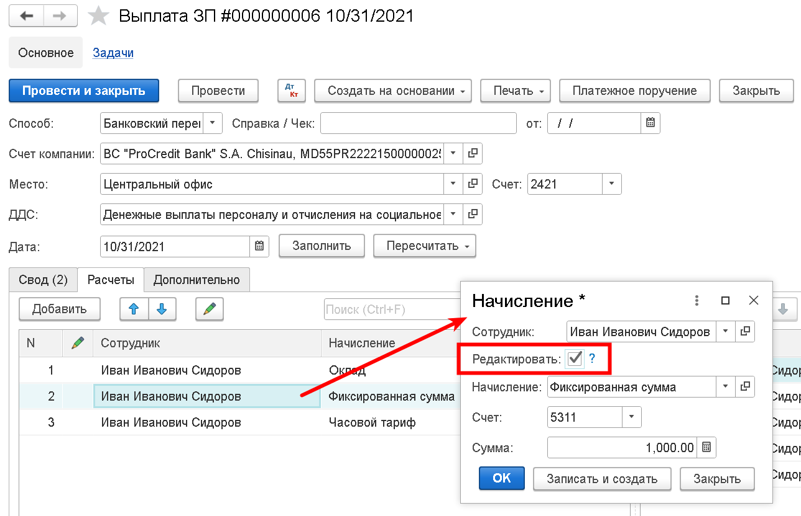

# Каким образом ввести сотруднику оклад и премиальные, рассчитываемые от суммы оклада?

При [приеме на работу](/d/Hiring) следует воспользоваться таблицей `Дополнительные начисления` (таблица доступна при начале редактирования строки требуемого сотрудника), где указать начисление `Процент от оклада` и заполнить значение процента.

# Для чего нужно отклонение с типом «Резерв +/-»?

Это нужно в случаях, когда предприятие вместо сверхурочных, накапливает часы переработки, с последующей возможностью их зачета в случае отсутствия сотрудника на работе. Эта информация регистрируется при вводе документа {!id/timesheet.md!}.

Например, если сотруднику нужно уйти в среду с работы на два часа раньше, он может в понедельник, отработать больше положенного по графику, на эти два часа. В табеле он укажет 8 часов + 2 часа «Резерв +», а в среду 6 часов и 2 часа «Резерв –». Позже эти сведения попадают в начисление зарплаты, а затем это отражается в расчетном листке и других отчетах.

# Чем отличаются Сотрудники от Физических лиц?

Физические лица в программе ассоциированы с физическим субъектами, или проще говоря - с конкретными людьми. Сотрудники - это профиль физического лица, в котором определяется табельный номер, должность и другие характеристики.

Таким образом, в системе может быть создано несколько сотрудников со ссылкой на одно и тоже физическое лицо. Примерами таких случаев могут быть:

- Работа сотрудника по совместительству. В этом случае, нам нужно будет создать в справочнике [Сотрудники](/c/Employees) двух сотрудников и принять их на работу.
- Сотрудник работал и уволился, и через время снова устроился к нам на работу. В этом случае, нужно будет создать два сотрудника, с разными табельными номерами и другими атрибутами.

# Как начислить заработную плату от обратного?

Для того, чтобы документ [Начисление ЗП](/d/Payroll) производил расчет начисленной заработной платы от суммы на руки, необходимо в документе [Прием на работу](/d/Hiring), установить флаг `На руки` для выбранного сотрудника.

# Как ввести больничный за счет БГСС?

Для регистрации такого больничного необходимо:

1. Открыть журнал `Сотрудники / Больничные`
2. Создать документ
3. Заполнить реквизиты, а в поле `Начисление` указать вид начисления, метод расчета которого задан как `Больничные, только БГСС`:

Если в вашей базе нет такого начисления, создайте его, задав соответствующий метод расчета:

# Как начислить зарплату за произвольный период?

Для этого нужно в документе начисления зарплаты, указать нужный период заполнения:

# Как поменять начисленную сотруднику сумму зарплаты?

Документ начисления зарплаты производит расчет сумм к начислению автоматически. При необходимости, автоматические расчеты можно скорректировать. Для этой цели, нужно перейти к требуемой строке расчета, открыть двойным кликом запись, включить возможность редактирования флагом `Редактировать` и внести нужные изменения:

При включенном режиме редактирования, пользователю становятся доступными для редактирования все поля с данными. Система не производит контроль над информацией, внесенной пользователем в таком режиме.

!!!tip "Подсказка"
	Если требуется изменить только сумму расчета, новую сумму нужно ввести в два поля: `Результат` и `Результат в валюте бухучета`. В поле `Результат` нужно внести сумму начисления в валюте начисления, в поле `Результат в валюте бухучета` нужно ввести сумму в леях.

Если вы изменили сумму расчета начисления, вполне вероятно, что вам понадобится произвести пересчет налогов. Для этой цели, после завершения всех корректировок в таблице `Расчеты`, произведите пересчет налогов:

!!!tip "Подсказка"
	Кроме изменения уже произведенных программой расчетов, также существует возможность добавления/удаления записей в таблице `Расчеты`. Не забывайте при этих действиях, производить пересчет налогов, как было указано выше.

# Как произвести дополнительное разовое начисление?

Разовые дополнительные начисления (например, компенсация за неиспользованный отпуск) выполняются в документе [Начисление ЗП](/d/Payroll). Для этого, необходимо воспользоваться таблицей `Дополнительные начисления`:

Следует учитывать следующие нюансы:

- Зарегистрировать разовое дополнительное начисление можно только с основным. Нельзя ввести документ начисления зарплаты, в котором будут только дополнительные начисления. Это связано с тем, что в общем случае, дополнительное начисление может быть связано с основным (например, процент от оклада), которое (оклад) могло меняться в течении периода начисления зарплаты. В этом случае, дополнительное начисление будет разбито за две (или более) записи в таблице расчетов, в соответствии с зависимостью от основного.
- Рекомендуется заполнять таблицу с дополнительными начислениями, до заполнения самого документа. Так, вам не придется пересчитывать документ после добавления дополнительных начислений.

Для постоянных дополнительных начислений, следует использовать документы [Прием на работу](/d/Hiring) или [Кадровые изменения](/d/EmployeesTransfer).

# Налоги посчитались неправильно, что делать?

Этот вопрос относится сразу к двум документам: [Начисление ЗП](/d/Payroll) и [Выплата ЗП](/d/PayEmployees). Если никак не удается понять, почему программа произвела расчет налогов не так, как вы того ожидали, всегда есть возможность эти расчеты скорректировать. Для этого, в таблице с налогами (таблица расположена справа от таблицы `Расчеты`), нужно перейти к требуемой строке, открыть двойным кликом запись, включить возможность редактирования флагом `Редактировать` и внести нужные изменения:

При включенном режиме редактирования, пользователю становятся доступными для редактирования все поля с данными. Система не производит контроль над информацией, внесенной пользователем в таком режиме. Кроме редактирования строк таблицы, вы можете добавлять или удалять расчеты по своему усмотрению.

# Как выдать зарплату частично?

Существует два варианта. Первый - это указать процент выплаты при заполнении документа [Выплата ЗП](/d/PayEmployees):

Второй - это скорректировать сумму на руки, используя механизм корректировки записей. Для этой цели, после того, как вы заполнили документ, нужно перейти к требуемой строке расчета, открыть двойным кликом запись, включить возможность редактирования флагом `Редактировать` и внести нужные изменения:

Строго говоря, документ можно предварительно не заполнять, запись с суммой на выплату может быть добавлена в таблицу вручную, стандартным образом.

!!!warning "Внимание!"
	Не забывайте производить пересчет налогов, после того, как вы меняете направляемые на выплату суммы.

